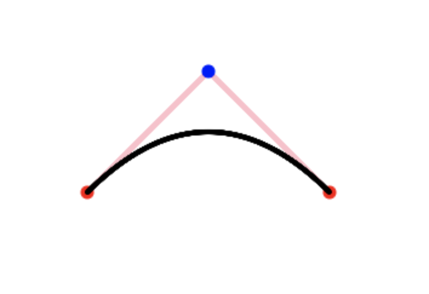

### 贝塞尔曲线实现

### 介绍

https://zh.wikipedia.org/wiki/%E8%B2%9D%E8%8C%B2%E6%9B%B2%E7%B7%9A

### 应用

1. 画图的时候画曲线，像爱心，抛物线等
2. 运动轨迹，像zuma 游戏中小球轨迹
3. css 中设置动画的运动加速度

### 实现




红色是起点或者终点

蓝色是其他点

粉红色是点的连线

黑色是贝塞尔曲线

项目链接： https://bezier-taupe.vercel.app/

#### 实现思路


##### 贝塞尔曲线算法

[线性插值](https://zh.wikipedia.org/wiki/線性插值) 公式

B(t) = P0 + (P1 - P0)  *  t

t 在值在0 到 1之间

```javascript
const interpolate = (a, b, factor) => {
  return a + (b - a) * factor;
};
```

二阶

```javascript
const vectorInterpolate = (p1, p2, factor) => {
  return [interpolate(p1[0], p2[0], factor), interpolate(p1[1], p2[1], factor)];
};

const bezier2 = (start, end, p1, factor) => {
  const c1 = vectorInterpolate(start, p1, factor);
  const c2 = vectorInterpolate(p1, end, factor);
  const p = vectorInterpolate(c1, c2, factor);
  return p;
};
```

三阶

```javascript
const bezier3 = (start, end, p1, p2, factor) => {
  const c1 = vectorInterpolate(start, p1, factor);
  const c2 = vectorInterpolate(p1, p2, factor);
  const c3 = vectorInterpolate(p2, end, factor);

  return bezier2(c1, c3, c2, factor);
};
```

 n 阶

```javascript
const bezier = (positions, factor) => {
  while (positions.length > 1) {
    const newPostions = [];
    positions.forEach((item, index) => {
      if (index === positions.length - 1) {
        return;
      }
      let p = vectorInterpolate(item, positions[index + 1], factor);
      newPostions.push(p);
    });
    return bezier(newPostions, factor);
  }
  return positions;
};
```

##### 案例实现思路

1. 画点
2. 画线
3. 画曲线

###### 画点

```javascript
const drawPoint = (
  canvas,
  point,
  size = 3,
  color = "black",
) => {
  const [x, y] = point;
  const ctx = canvas.getContext("2d");
  ctx.fillStyle = color;

  ctx.strokeStyle = color;

  ctx.beginPath();
  ctx.arc(x, y, size / 2, 0, 2 * Math.PI);
  ctx.fill();
  ctx.stroke();
};

const drawPoints = (canvas, positions) => {
  const startIndex = 0
  const endIndex = positions.length - 1
  
  positions.forEach((p, i) => {
    if ([startIndex, endIndex].includes(i)) {
      drawPoint(canvas, p, 10, "red");
      return
    }
    drawPoint(canvas, p, 10, "blue");
  });
};
```

###### 画线

```javascript
const drawLine = (canvas, p1, p2) => {
  for (let i = 0; i < 1; i += 0.001) {
    let p = vectorInterpolate(p1, p2, i);
    drawPoint(canvas, p, 3, "pink", true);
  }
};

const drawLines = (canvas, positions) => {
  positions.forEach((p, i) => {
    if (positions.length - 1 === i) {
      return
    }
    drawLine(canvas, p, positions[i + 1]);
  });
};
```

###### 画曲线

```javascript
const drawBezier = (canvas, positions) => {
  for (let i = 0; i < 1; i += 0.001) {
    let p = bezier(positions, i)[0]
    drawPoint(canvas, p);
  }
}
```

主函数

```javascript
const __main = () => {
  const canvas = document.querySelector(".g-canvas");

  const start = [100, 200]
  const end = [300, 200]

  const p1 = [200, 100]

  const ps = [start, p1, end]
  
  drawLines(canvas, ps)
  drawPoints(canvas, ps)
  drawBezier(canvas, ps)
};

__main();
```

#### 后期计划

1. 点击点可以拖拽
2. 添加动态演示效果


